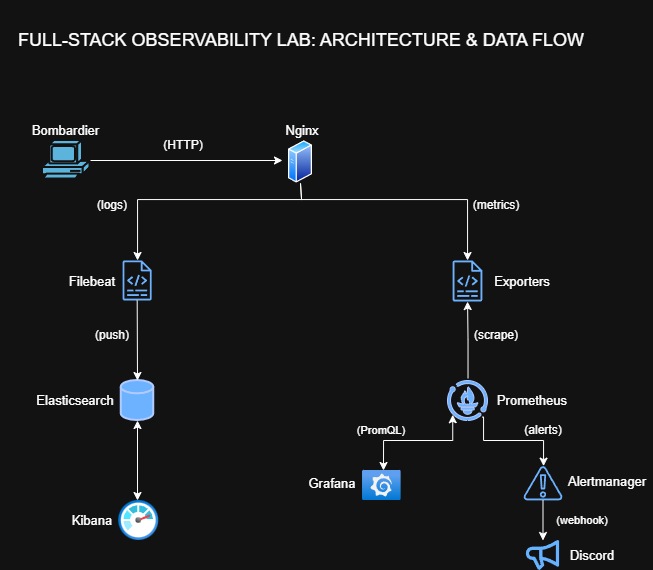
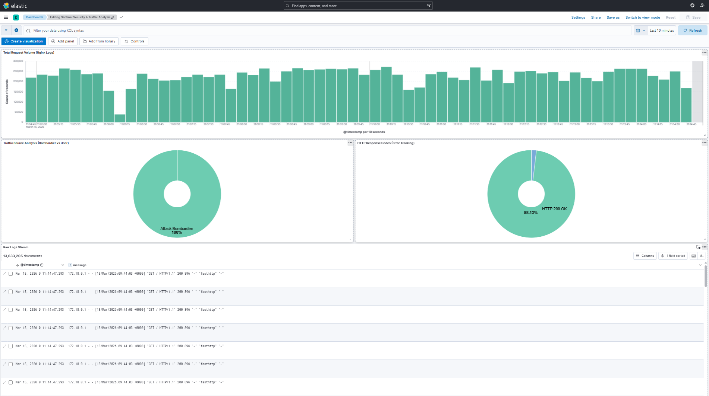
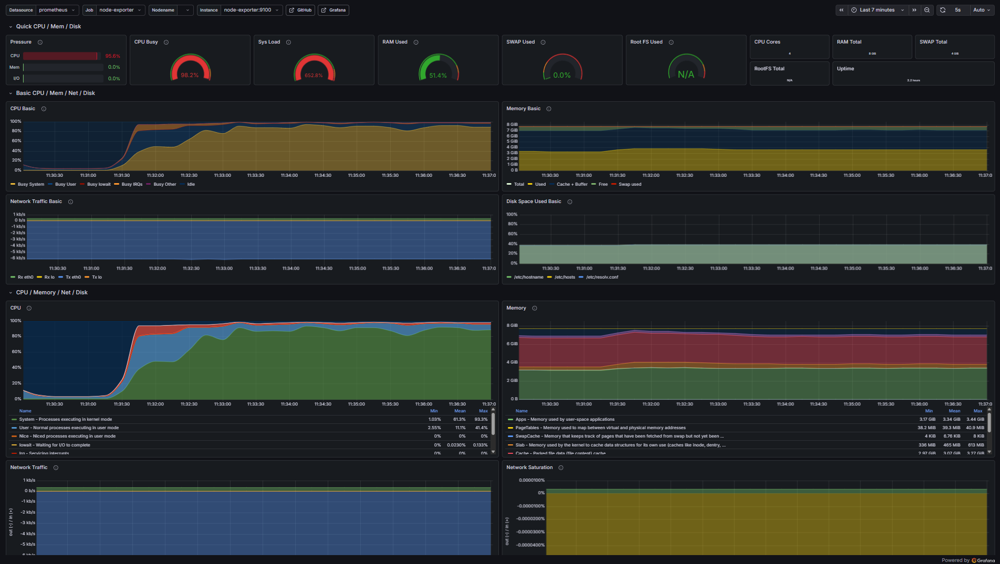
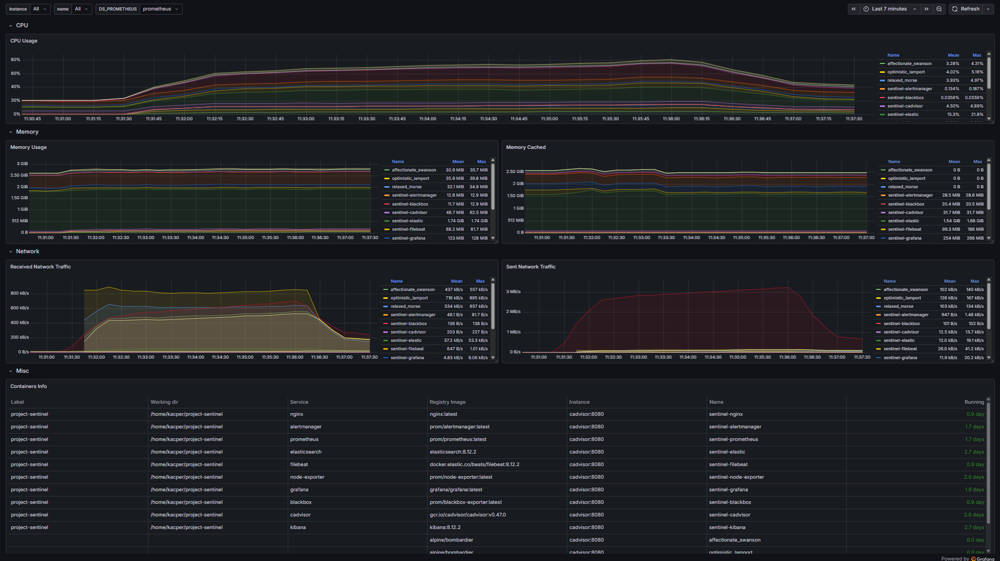
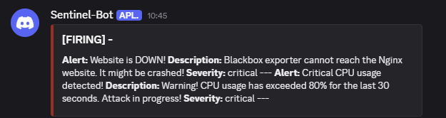
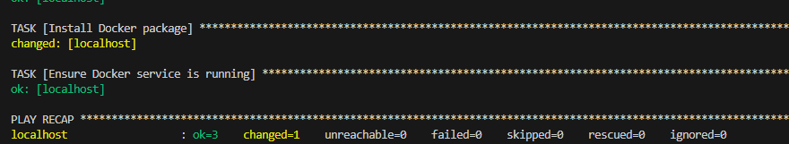

# Project Sentinel: Full-Stack Observability & Resilience Lab

## Overview
This laboratory environment simulates a production-grade observability stack built from scratch on an Ubuntu Server. 
Instead of relying on cloud-managed services, this project demonstrates hands-on experience in provisioning infrastructure (Ansible), containerizing services (Docker), generating synthetic traffic (DDoS simulation), and monitoring both logs and hardware metrics in real-time.

## Features
- **Infrastructure as Code (IaC):** Automated Docker provisioning and service management using Ansible.
- **Advanced Log Analytics:** Real-time ingestion of Nginx access/error logs via Filebeat to Elasticsearch. Custom Kibana Dashboards (KQL) identify botnet traffic (`fasthttp`) and monitor HTTP status codes.
- **Deep Observability:** Prometheus continuously scrapes hardware metrics via Node Exporter and container-level metrics via cAdvisor. Leveraged industry-standard community Grafana dashboards (IDs 1860 and 14282) for rapid and reliable metric visualization, while building custom KQL dashboards in Kibana from scratch.
- **Active Probing:** Blackbox Exporter continuously checks the HTTP endpoint health of the Nginx server.
- **Automated Incident Response:** Alertmanager evaluates PromQL rules (e.g., `CPU > 80%` or `probe_success == 0`) and automatically fires webhook notifications directly to a Discord channel.

## Tech Stack
- **OS & Virtualization:** Ubuntu Server 24.04 LTS (VMware Workstation Pro)
- **Automation & Containerization:** Ansible, Docker, Docker Compose
- **Web & Traffic:** Nginx, Bombardier (HTTP load generator)
- **Log Pipeline (ELK):** Filebeat, Elasticsearch, Kibana
- **Metrics & Alerting:** Prometheus, Grafana, Node Exporter, cAdvisor, Blackbox Exporter, Alertmanager

## Key Results (Screenshots)

### 1. Security Operations Center (Kibana)
Visualizing 13.6M logs during a simulated DDoS attack. Bombardier traffic (100%) is successfully isolated from normal users, with HTTP 200/404 ratios tracked.

### 2. Infrastructure Meltdown (Grafana)
Monitoring a critical CPU spike (95.6%) triggered by the Bombardier stress test, using Node Exporter and cAdvisor dashboards.

*

### 3. Incident Alerting (Discord Webhook)
Real-time critical alerts delivered from Prometheus/Alertmanager directly to Discord during the attack.

### 4. Automated Provisioning (Ansible)
Idempotent Docker installation via `install-docker.yml`.

## Usage / Reproducing the Lab
*Note: All configuration files (`docker-compose.yml`, `prometheus.yml`, etc.) are included in this repository.*

1. **Install Docker via Ansible:**
   ansible-playbook install-docker.yml -K
2. **Deploy the full observability stack:**
   docker compose up -d
3. **Trigger the DDoS simulation (Bombardier):**
  for i in {1..4}; do sudo docker run -d --rm alpine/bombardier -c 1000 -d 300s http://<YOUR_IP>:80; done
4. **Access the dashboards:**
- *Grafana:* http://<YOUR_IP>:3000
- *Kibana:* http://<YOUR_IP>:5601
- *Prometheus Alerts:* http://<YOUR_IP>:9090/alerts

# PROJECT NOTES Project Sentinel: Full-Stack Observability & Resilience Lab

STACK:
Vmware Workstation Pro | Ubuntu | Ansible | Docker | Nginx | Bombardier | Filebeat | ELK ElasticSearch + Kibana | Prometheus + NodeExporter + cAdvisor + Alert Manager + Blackbox | Grafana

VMware Workstation Pro: Program do wirtualizacji, pozwalajacy na postawienie roznych OS na jednym komputerze
Ubuntu Server: Czysty system operacyjny Linux
Ansible: Narzędzie do automatyzacji - loguje się na serwer i instaluje wszystko za pomocą kodu - mowi dockerowi co ma postawic
Docker: Silnik, który uruchamia i utrzymuje aplikacje w izolowanych kontenerach

Nginx: Serwer WWW (ofiara) – hostuje stronę i generuje logi tekstowe z wejść oraz błędów
Bombardier: Generator ruchu – masowo wysyła zapytania HTTP do Nginxa, by maksymalnie go obciążyć.

Filebeat: Kurier siedzacy kolo Nginxa – na bieżąco czyta pliki tekstowe z logami Nginxa i wysyła je do bazy
Elasticsearch: Potężna baza danych – magazynuje wszystkie logi tekstowe zebrane przez Filebeata
Kibana: Panel graficzny do bazy Elasticsearch – tu przeglądasz logi i szukasz tekstowych przyczyn awarii.

Prometheus: Zbieracz danych liczbowych – cyklicznie pobiera i zapisuje stan sprzętu (użycie CPU, RAM, czas odpowiedzi).
Node Exporter & cAdvisor: Agenci sprzętowi – dostarczają Prometheusowi dane o obciążeniu całego serwera i samych kontenerów.
Alertmanager: System alarmowy – wysyła powiadomienie do użytkownika, gdy w Prometheusie przekroczono krytyczny próg (np. brak RAMu).
Grafana: Ostateczne centrum dowodzenia – łączy surowe liczby z Prometheusa i logi w piękne, czytelne dashboardy na jednym ekranie.

Na wirtualnej maszynie z Ubuntu używam skryptów Ansible do automatycznego wdrożenia Dockera i uruchomienia wszystkich systemów w odzielnych kontenerach. Następnie Bombardier sztucznie przeciąża serwer Nginx, generując awarie, których logi tekstowe na bieżąco zbiera i analizuje stack ELK. Elasticsearch jako baza pobiera dane wysylane przez filebeat, a kibana te logi wyswietla. Równocześnie Prometheus mierzy krytyczne zużycie sprzętu (CPU/RAM) za pomoca node exportera i cadvisora, a wszystkie te dane łączy i wyświetla na jednym ekranie Grafana. Alerty trafiaja za pomoca alertmanagera do uzytkownika.

- Install Vmware Workstation Pro 25H2
- Download Ubuntu Server 24.04.4 LTS
- Change IP to Static by update netplan in files: (192.168.225.128/24 - VM)
- In fluent terminal - connect ssh by kacper@192.168.225.128
- Install Ansible in fluent
  sudo apt update | sudo apt install ansible -y | ansible version 2.16.3
- Open VisualStudio install remote-ssh extention
  connect to shh in VS
- Create new folder by mkdir project-sentinel in VS
- Create new yaml file to install docker: 🚀
---
- name: Install Docker on the server
  hosts: localhost
  become: yes
  tasks:
    - name: Install Docker package
      apt:
        name: docker.io
        state: present
        update_cache: yes
    - name: Ensure Docker service is running
      service:
        name: docker
        state: started
        enabled: yes 🚀
      
-  ansible-playbook install-docker.yml -K -> to install docker by yaml file
- Create new yaml file to install nginx by docker-compose.yml: 🚀
  nginx:
    image: nginx:latest
    container_name: sentinel-nginx
    ports:
      - "80:80"
    volumes:
      - ./nginx-logs:/var/log/nginx
    restart: unless-stopped 🚀
- Now our site Nginx is running - ip the same as VM http://192.168.225.128
- We are increasin mapping limit on linux by: sudo sysctl -w vm.max_map_count=262144
- Install ElasticSearch by adding to docker-compose.yml: 🚀
    elasticsearch:
    image: elasticsearch:8.12.2
    container_name: sentinel-elastic
    environment:
      - discovery.type=single-node
      - xpack.security.enabled=false
      - ES_JAVA_OPTS=-Xms1g -Xmx1g
    ports:
      - "9200:9200"
    restart: unless-stopped 🚀
                                next: docker compose up -d
- Now we got 2 containers in Docker: nginx and elasticsearch
- Updating docker-compose.yml by adding kibana depends on elasticsearch: 🚀
    kibana:
    image: kibana:8.12.2
    container_name: sentinel-kibana
    environment:
      - ELASTICSEARCH_HOSTS=http.//elasticsearch:9200
    ports:
      - "5601:5601"
    depends_on:
      - elasticsearch
    restart: unless-stopped 🚀
- kibana - http://192.168.225.128:5601
- Now we got 3 containers: Nginx, Elasticsearch and Kibana
- We have to add new yaml file to configure filebeat -> to take logs from Nginx and upload them to Elasticsearch
- filebeat.yml: 🚀
filebeat.inputs:
- type: log
  enabled: true
  paths:
    - /var/log/auth.log
    - /var/log/syslog
    - /var/log/nginx/*.log

output.elasticsearch:
  hosts: ["elasticsearch:9200"]

setup.kibana:
  host: "kibana:5601" 🚀
- We have to change file owner to root by: sudo chown root filebeat.yml and sudo chmod 644 filebeat.yml
- Now our kibana is working, and we can create dashboards
- We are creating new file: prometheus.yml -> in this file, we are configuring prometheus, node-exporter to count procesor using and RAM on whole ubuntu server, and cadvisor to count which container using memory. prometheus.yml: 🚀
  global:
    scrape_interval: 15s

  scrape_configs:
    - job_name: 'prometheus'
      static_configs:
        - targets: ['localhost:9090']
  
    - job_name: 'node-exporter'
      static_configs:
        -targets: ['node-exporter:9100']

    - job_name: 'cadvisor'
      static_configs:
        - targets: ['cadvisor:8080'] 🚀
- Then, we have to modificate docker-compose.yml file: 🚀
    prometheus:
      image: prom/prometheus:latest
      container_name: sentinel-prometheus
      volumes:
        - ./prometheus.yml:/etc/prometheus/prometheus.yml:ro
      ports:
        - "9090:9090"
      restart: unless-stopped

    node-exporter:
      image: prom/node-exporter:latest
      container_name: sentinel-node-exporter
      ports:
        - "9100:9100"
      restart: unless-stopped

    cadvisor:
      image: gcr.io/cadvisor/cadvisor:v0.47.0
      container_name: sentinel-cadvisor
      volumes:
        - /:/rootfs:ro
        - /var/run:/var/run:ro
        - /sys:/sys:ro
        - /var/lib/docker/:/var/lib/docker:ro
        - /dev/disk/:/dev/disk:ro
      ports:
        - "8080:8080"
      privileged: true 
      restart: unless-stopped 🚀
- Prometheus: http://192.168.225.128:9090/
- We have to configure grafana in docker-compose.yml by:
    grafana:
    image: grafana/grafana:latest
    container_name: sentinel-grafana
    ports:
      - "3000:3000"
    depends_on:
      - prometheus
    restart: unless-stopped 🚀
- Grafana is now working: http://192.168.225.128:3000/ -> login: admin password - the same as vm
- We have to add data source in grafana by writing prometheus URL: http://prometheus:9090
- We took already exists ID of dashboard to visualize node exporter full [ id = 1860], and cadvisor [id = 14282] and configure them to visualize our containers data, and ubuntu whole server data memory
- We are adding AlertManager to alert as if CPU usage > 80%, we have to add file alerts.yml: 🚀
  groups:
  - name: sentinel_alerts
    rules:
      - alert: HighCpuUsage
        expr: 100 - (avg by (instance) (rate(node_cpu_seconds_total{mode="idle"}[1m])) * 100) > 80
        for: 10s
        labels:
          severity: critical
        annotations:
          summary: "Critical CPU usage detected!"
          description: "Warning! CPU usage has exceeded 80%! Attack in progress!" 🚀
- Then alertmanager.yml to also SEND ALERTS TO DISCORD CHANNEL on my discord server by custom webhook: 🚀
route:
  receiver: 'discord_alert'
  group_wait: 1s
  group_interval: 10s
  repeat_interval: 1m

receivers:
  - name: 'discord_alert'
    discord_configs:
      - webhook_url: ''YOUR_DISCORD_WEBHOOK_URL''
        send_resolved: true
        title: '[{{ .Status | toUpper }}] - {{ .GroupLabels.alertname }}'
        message: >
          {{ range .Alerts }}
          **Alert:** {{ .Annotations.summary }}
          **Description:** {{ .Annotations.description }}
          **Severity:** {{ .Labels.severity }}
          ---
          {{ end }} 🚀
- Edit file docker-compose.yml by adding alert manager, and then configure volumes of prometheus: 🚀
    alertmanager:
    image: prom/alertmanager:latest
    container_name: sentinel-alertmanager
    ports:
      - "9093:9093"
    volumes:
      - ./alertmanager.yml/:/etc/alertmanager/alertmanager.yml:ro
    restart: unless-stopped
    depends_on:
      - prometheus
  and
    in prom section:  - ./alerts.yml:/etc/prometheus/alerts.yml:ro 🚀
- Our alertmanager is working on: http://192.168.225.128:9093/#/alerts
- We have our alert on prometheus site in section alerts:
    
- Now, we have to download bombardier by:
  sudo docker pull alpine/bombardier
and then start it:
  sudo docker run --rm alpine/bombardier -c 1000 -d 300s http://192.168.225.128:80
- Now, on prometheus we see Firing - which means, attack in progress, then we can see notes in alertmanager that attack is in progress
- By configuring discord-alertmanager webhook, we can see that HighCpuUsage critical:
  [FIRING:1]  (HighCpuUsage node-exporter:9100 critical)
  WARNING! Server attack detected! Critical CPU limit exceeded!

- We are attacking our Nginx by 4 bombardier's host, to peak HighCpuUsage to at least 80%: 🚀
  for i in {1..4}; do sudo docker run -d --rm alpine/bombardier -c 1000 -d 300s http://192.168.225.128:80; done 🚀
- We are adding blackbox to check if nginx is still working, we have to modificate docker-compose.yml by adding: 🚀
      blackbox:
      image: prom/blackbox-exporter:latest
      container_name: sentinel-blackbox
      ports:
        - "9115:9115"
      restart: unless-stopped 🚀
  then - we  have to configure prometheus.yml by adding blackbox there: 🚀
  - job_name: 'blackbox'
    metrics_path: /probe
    params:
      module: [http_2xx]
    static_configs:
      - targets:
        - http://nginx:80
    relabel_configs:
      - source_labels: [__address__]
        target_label: __param_target
      - source_labels: [__param_target]
        target_label: instance
      - target_label: __address__
        replacement: blackbox:9115 🚀
  - We are adding more alerts -> Server is not reachable - eg. NodeExporter, and second -> Nginx (site) is unreachable:  🚀
  - alert: InstanceDown
    expr: up == 0
    for: 30s
    labels:
      severity: critical
    annotations:
      summary: "Instance {{ $labels.instance }} is down!"
      description: "The monitoring agent on {{ $labels.instance }} has stopped responding."

  - alert: WebsiteDown
    expr: probe_success == 0
    for: 30s
    labels:
      severity: critical
    annotations:
      summary: "Website is DOWN!"
      description: "Blackbox exporter cnnot reach the Nginx website. It might be crashed!"  🚀
- We have to add one volume on filebeat in docker-compose.yml:  🚀
  - ./nginx-logs:/var/log/nginx:ro  🚀
- Now our filebeat service in docker-compose.yml: 🚀
    filebeat:
      image: docker.elastic.co/beats/filebeat:8.12.2
      container_name: sentinel-filebeat
      user: root
      volumes:
        - ./filebeat.yml:/usr/share/filebeat/filebeat.yml:ro
        - /var/log:/var/log:ro
        - ./nginx-logs:/nginx-logs:ro
      depends_on:
- Now, we can see on discord alerts that: [FIRING] -
Alert: Website is DOWN! Description: Blackbox exporter cnnot reach the Nginx website. It might be crashed! Severity: critical --- Alert: Critical CPU usage detected! Description: Warning! CPU usage has exceeded 80% for the last 30 seconds. Attack in progress! Severity: critical ---

- We are creating dashboard in Kibana, with total request volume (nginx logs) -> amount of logs, traffic source analysis (bombardier vs user), http response cod (error404 vs 200OK), raw logs stream -> we can see source IP from atacking person, date, code status, and attack-name (user-agent)
   
